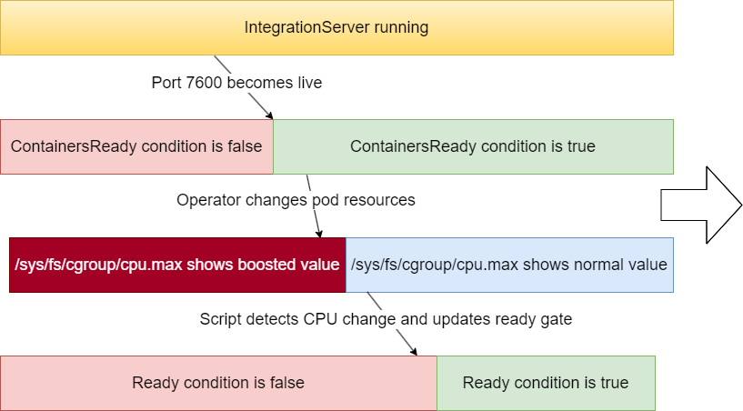

# ace-burst-cpu-experiments

Experiments with ACE containers and CPU boost during startup.

## Background

ACE containers often require more CPU during startup than they do during steady-state 
operation, but Kubernetes has historically insisted that CPU limits remaing fixed for
the lifetime of a container. As IBM container licensing (which includes ACE) is based
on CPU limits, ACE containers can either be configured with adequate CPU for startup
(resulting in higher licensing cost) or limits based on steady-state CPU usage (which
results in slow startup times).

This issue is not unique to ACE, and an Alpha feature called [In-place Resource Resize
for Kubernetes Pods](https://kubernetes.io/blog/2023/05/12/in-place-pod-resize-alpha/)
has recently added to Kubernetes to provide a way around this by allowing CPU limits to
be changed (and take effect) while a pod is running. The pod definition can be updated
directly via API calls, but Google have also created a [Kube Startup CPU Boost](https://github.com/google/kube-startup-cpu-boost)
operator that will automatically boost CPU limits during startup (before the container 
is ready) and then restore the original limits once the container becomes ready.

The operator works well with ACE containers from a technical standpoint (startup is 
indeed faster, and limits are restored) but there is a potential issue with licensing
due to the time interval between the container becoming ready and the CPU limits being
adjusted downwards: if the license service detects the running container is ready 
before the CPU has been changed down, then it will record the higher (startup) CPU 
limit for the container. This is not a defect with the license service (limits have up
until now been fixed for the lifetime of the container) but could be problematic for 
ACE customers, and this repo shows a way to avoid the timing window.

Note that this repo depends on an Alpha feature in Kubernetes and the Google operator
is similarly unsupported, but the technical possiblities are clearly promising. Customers
interested in this approach should raise an [AHA idea](https://integration-development.ideas.aha.io/?project=APPC)
to communicate with IBM product management.

This repo has been tested with Minikube v1.32.0 with `--feature-gates=InPlacePodVerticalScaling=true`
to validate the approach; the ACE server has nothing deployed as this demo is intended to
docus on startup time.

## ACE solution

Closing the timing window requires the "Ready" condition for the pod to be false until 
the CPU settings have been changed and taken effect, and achieving this requires several
additional pieces for the solution:

- A ["readiness gate"](https://kubernetes.io/docs/concepts/workloads/pods/pod-lifecycle/#pod-readiness-gate)
  that ensures the pod only becomes officially "Ready" when an application-controlled 
  condition is met.
- In order to know when to change the readiness gate, there needs to be a way to check 
  if the CPU limits have been changed down, and so a script is needed to poll `/sys/fs/cgroup/cpu.max` 
  to wait for it to reflect the lower values and then call a Kubernetes API to set the
  readiness gate to true.
- The Kube Startup CPU Boost operator must be told to check for the "ContainersReady"
  condition to be true rather than the more-usual "Ready" condition. This will cause the
  operator to change the CPU back down to the normal level when the pod containers are
  ready without requiring the whole pod be marked as ready (which would trigger the 
  license service).

Putting those pieces together gives the following sequence:



The license service will only ready the CPU limits for the pod when the "Ready" condition
is true (the bottom-right green segment) and by that time the CPU limits will have been
changed back down to the normal level. In this way the container can start quickly but only
use the minimum required CPU when actually processing messages.

This solution does require the pod service account to be able to PATCH the pod status, but
does not require it to be able to patch the pod definition itself; as permissions are granted
on a per-namespace basis, giving the pod permission to patch itself would also grant it
permissions to patch any other pod in the namespace. Patching the status for other pods has
much less potential for mischief than being able to patch the pods themselves.

## Details

### Readiness gate

Creating the gate requires the [pod yaml](create-pod.yaml) to specify
```
  readinessGates:
    - conditionType: "CPUChangeCondition"
```
at which point the pod will not become ready until a condition of that type is marked true.
Until that point, the pod will not be ready and the status will show 
`ReadinessGatesNotReady - corresponding condition of pod readiness gate "CPUChangeCondition" does not exist.`

### CPU script

The [poll-for-cpu-change.sh](poll-for-cpu-change.sh) script is started from the ENTRYPOINT for the
container and checks `/sys/fs/cgroup/cpu.max` to see if it matches the expected (lower) CPU values
provided in the `EXPECTEDCPU` environment variable (which must match the actual CPU limits). When
it detects a match, it uses curl to set the readiness gate to true:
```
curl -v -k -X PATCH -H 'content-type: application/strategic-merge-patch+json' 
--data '{ "status": { "conditions": [ { "type": "CPUChangeCondition", "status": "True" } ] } }' 
--header "Authorization: Bearer ${TOKEN}" ${APISERVER}/api/v1/namespaces/ace-demo/pods/ace-burst-test/status
```

### Operator configuration

The [Kube Startup CPU Boost](https://github.com/google/kube-startup-cpu-boost) operator must be told
to check for `ContainersReady` in the [configuration YAML](boost-cpu.yaml) as follows
```
  durationPolicy:
    podCondition:
      type: ContainersReady
      status: "True"
```
as this will cause it to lower the CPU value once port 7600 becomes active.

### Service account configuration

The pod [service account](service-account.yaml) must have permission to set the readiness gate
to true using PATCH, but does not require any other permissions:
```
rules:
- apiGroups: [""]
  resources: ["pods/status"]
  verbs: ["patch"]
```

## Other possibilities

- The pod could be given permission to patch itself, at which point it could set the CPU
  up in an ENTRYPOINT script and then down again once startup had completed. This would 
  still require a readiness gate unless the ACE product is changed to provide a startup
  script option that would be invoked just before the flows are started (and port 7600
  becomes live) so the CPU can be lowered before the pod becomes ready.
- The ACE operator could be modified so it sets the CPU values (instead of using the Google
  operator) and then also sets the readiness gate. This would eliminate the need for the
  pod to have any PATCH permissions.
